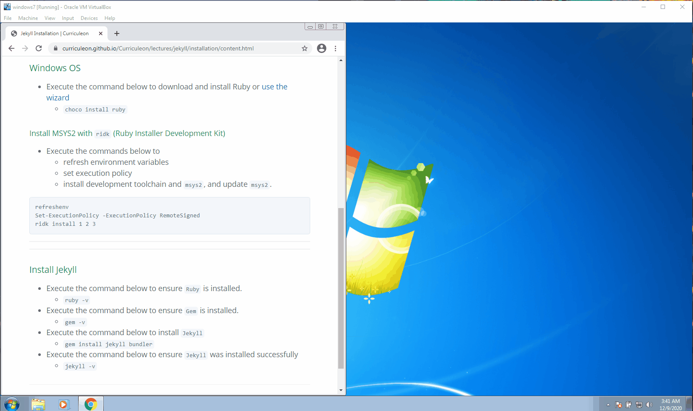

# Jekyll Installation - Windows OS

### Ruby Installer
* Execute the commands below from an Administrative Powershell window

<!-- 
```ps1
Invoke-WebRequest -Uri https://gist.githubusercontent.com/ferventcoder/947479688d930e28d632/raw/5b37df9ed8b3a88fcfa28d6a2d81849613158ee1/RubyStack.ps1 -OutFile ruby-installer.ps1
powershell -ExecutionPolicy Bypass -File ruby-installer.ps1
```
 -->

### Ruby Installer
* Ensure you download version [`2.7.2-2 (x64)`](https://github.com/oneclick/rubyinstaller2/releases/download/RubyInstaller-2.7.2-1/rubyinstaller-devkit-2.7.2-1-x64.exe) or [use the wizard](./ruby-wizard.md)
	* `choco install ruby --version=2.7.2.1`

[](./install-ruby.gif)

### Ruby DevKit Installer
* Execute the command below to download and install Ruby or [use the wizard](./ruby-wizard.md)
	* `choco install ruby2.devkit`

[](./install-ruby2devkit.gif)

### Install MSYS2 with `ridk` (Ruby Installer Development Kit)
* Execute the commands below to 
	* refresh environment variables
	* set execution policy
	* install development toolchain and [`msys2`](https://www.msys2.org/), and update `msys2`.


```ps1
refreshenv
Set-ExecutionPolicy -ExecutionPolicy RemoteSigned 
ridk install 1 2 3
```

[](./install-ridk.gif)


### Install Jekyll
* Execute the command below to ensure `Ruby` is installed.
	* `ruby -v`
* Execute the command below to ensure `Gem` is installed.
	* `gem -v`
* Execute the command below to install `Jekyll`
	* `gem install jekyll bundler`
* Execute the command below to ensure `Jekyll` was installed successfully
	* `jekyll -v`

[](install-jekyll.gif)