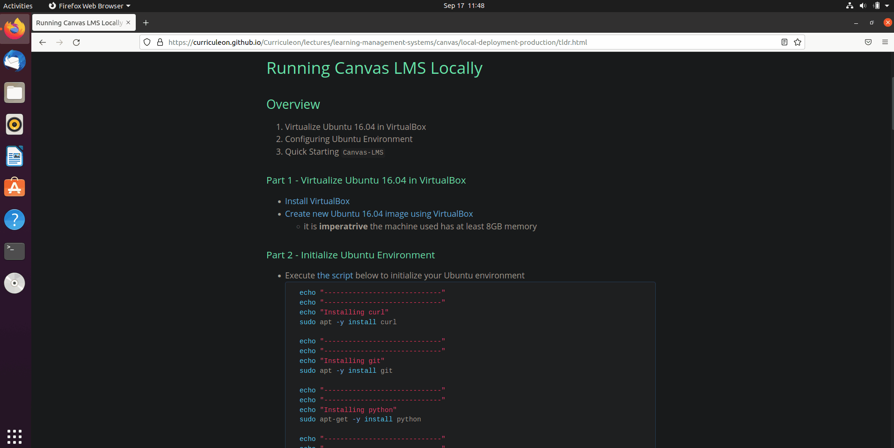

<!--
https://www.linode.com/docs/guides/install-canvas-lms-on-ubuntu-2004/
https://github-wiki-see.page/m/mskcodes/canvas-lms/wiki/Production-Start
https://github.com/FreedomBen/canvas-development-tools/
https://www.youtube.com/watch?v=s6aLDJtkeNc&ab_channel=%E6%9D%9C%E6%9D%9C
-->

# Running Canvas LMS Locally

## Overview
1. Virtualize Ubuntu 16.04 in VirtualBox
2. Configuring Ubuntu Environment
3. Quick Starting `Canvas-LMS`


### Part 1 - Virtualize Ubuntu 16.04 in VirtualBox
* [Install VirtualBox](https://curriculeon.github.io/Curriculeon/lectures/virtualization/virtual-box/installation/content.html)
* [Create new Ubuntu 16.04 image using VirtualBox](https://curriculeon.github.io/Curriculeon/lectures/virtualization/virtual-box/install-ubuntu/content.html)
	* it is **imperatrive** the machine used has at least 8GB memory


### Part 2 - Initialize Ubuntu Environment
* Download [this file](./initialize-ubuntu-environment.sh).
* Change the file's permissions to executable
	* `chmod u+x ~/Downloads/initialize-ubuntu-environment.sh`
* Execute the file
	* `~/Downloads/initialize-ubuntu-environment.sh`

[](./imgs/initialize-ubuntu-for-canvaslms.gif)

### Part 3 - Configure Initial Settings

* Execute the commands below to configure database settings

	```bash
	cd /var/canvas/config
	sudo nano database.yml
	```
	
	* Ensure the `production` property's `username` and `password` have been set to your respective postgres `username` and `password`
		* Use `echo $USER` to recall the `username` from this tutorial

* Execute the commands below to configure database settings

	```bash
	cd /var/canvas/config
	sudo nano outgoing_mail.yml
	```
	
	* Ensure the `production` property's `address` has been set to your email address's smtp address.
		* `gmail` is `smtp.gmail.com` for example
	* Ensure the `production` property's `username` has been set your email address
	* Ensure the `production` property's `password` has been set your email password
	* Ensure the `production` property's `domain` has been set to `testcanvas.com`
	* Ensure the `production` property's `outgoing_address` has been set to the email address that canvas will send mail from

* Execute the commands below to configure domain settings

	```bash
	cd /var/canvas/config
	sudo nano domain.yml
	```
	
	* Ensure the `production` property's `domain` has been set to `testcanvas.com`

* Execute the commands below to configure security settings

	```bash
	cd /var/canvas/config
	sudo nano security.yml
	```
	
	* Ensure the `production` property's `encryption_key` has been set a value of at least 20 digits.
		* Copy the stdout from the command below to autogenerate an encryption key
			* `cat /dev/urandom | tr -dc 'A-Za-z0-9' | head -c 24; echo ''`


### Part 4 - Create Asset Directories
* Execute the commands below to create directories to store canvas-generated files

	```bash
	cd /var/canvas	
	sudo mkdir -p log tmp/pids public/assets app/stylesheets/brandable_css_brands
	sudo touch app/stylesheets/s_defaults_autogenerated.scss
	sudo touch Gemfile.lock
	sudo touch log/production.log		
	sudo chown -R $USER config/environment.rb log tmp public/assets app/*
	sudo yarn install
	```

### Part 5 - Restart Apache Server 

* Execute the commands below to restart the Apache server to reduce memory consumption

	```bash
	sudo systemctl reload apache2
	sudo systemctl restart apache2
	```

### Part 6 - Populate Asset Directories

* Execute the commands below to build canvas-generated files

	```bash
	cd /var/canvas
	RAILS_ENV=production bundle exec rake db:reset_encryption_key_hash
	RAILS_ENV=production bundle exec rake canvas:compile_assets
	```

	* **Note** - Your machine must have at least 8GB memory to run the commands above. The command below is particularly expensive, and is otherwise unexecutable. You may need to execute this command several times if it fails.
		* `RAILS_ENV=production bundle exec rake canvas:compile_assets`

### Part 7 - Assign ownership of `public`
* Execute the command below to assign ownership of the `public` directory to the current user.

	```bash
	cd /var/canvas
	sudo chown -R $USER public/
	```
		
### Part 8 - Populate Database

* Execute the command below to populate database

	```bash
	cd /var/canvas
	RAILS_ENV=production bundle exec rake db:initial_setup
	```
	
	* Upon being prompted to create an administrator account, set the following environment variables respectively

<table>
	<thead>
		<tr>
			<th>Environment Variable</th>
			<th>Value(s) supported</th>
		</tr>
	</thead>
	<tbody>
		<tr>
			<td>CANVAS_LMS_ADMIN_EMAIL</td>
			<td>E-mail address used for default administrator login</td>
		</tr>
		<tr>
			<td>CANVAS_LMS_ADMIN_PASSWORD</td>
			<td>Password for default administrator login</td>
		</tr>
		<tr>
			<td>CANVAS_LMS_ACCOUNT_NAME</td>
			<td>Account name seen by users, usually your organization name</td>
		</tr>
		<tr>
			<td>CANVAS_LMS_STATS_COLLECTION</td>
			<td>opt_in, opt_out, or anonymized</td>
		</tr>
	</tbody>
</table>


### Part 9 - Configure Apache Passenger

* Execute command below to install `libapache2-mod-passenger`

	```bash
	sudo apt install -y dirmngr gnupg
	sudo apt-key adv --keyserver hkp://keyserver.ubuntu.com:80 --recv-keys 561F9B9CAC40B2F7
	sudo apt install -y apt-transport-https ca-certificates
	sudo chmod go=r /etc/apt/sources.list.d/passenger.list
	sudo -i -u $USER <<'EOF'
	echo deb [arch=amd64] https://oss-binaries.phusionpassenger.com/apt/passenger focal main > /etc/apt/sources.list.d/passenger.list ; exit
	EOF
	```

* Execute command below to enable `mod_rewrite`

	```bash
	sudo systemctl reload apache2
	sudo systemctl restart apache2
	sudo a2enmod rewrite
	```

* Execute command below to ensure Passenger is enabled for Apache configuration

	```bash
	sudo systemctl reload apache2
	sudo systemctl restart apache2
	sudo a2enmod passenger
	```

* Execute command below to ensure apache configuration supports SSL
	
	```bash
	sudo systemctl reload apache2
	sudo systemctl restart apache2
	sudo a2enmod ssl
	sudo systemctl reload apache2
	sudo systemctl restart apache2
	```

### Part 10 - Configure Canvas with Apache

* Execute the command below to disable any Apache VirtualHosts running

	```bash
	sudo unlink /etc/apache2/sites-enabled/000-default.conf
	```

* Execute the command below to create a virtual host

	```bash
	sudo nano /etc/apache2/sites-available/canvas.conf
	```

* Paste the snippet below in the newly created file

	```xml
	<VirtualHost *:80>
		ServerName canvas.example.com
		ServerAlias canvasfiles.example.com
		ServerAdmin youremail@example.com
		DocumentRoot /var/canvas/public
		RewriteEngine On
		RewriteCond %{HTTP:X-Forwarded-Proto} !=https
		RewriteCond %{REQUEST_URI} !^/health_check
		RewriteRule (.*) https://%{HTTP_HOST}%{REQUEST_URI} [L]
		ErrorLog /var/log/apache2/canvas_errors.log
		LogLevel warn
		CustomLog /var/log/apache2/canvas_access.log combined
		SetEnv RAILS_ENV production
		<Directory /var/canvas/public>
			Options All
    		AllowOverride All
    		Require all granted
		</Directory>
	</VirtualHost>
	<VirtualHost *:443>
		ServerName canvas.example.com
		ServerAlias canvasfiles.example.com
		ServerAdmin youremail@example.com
		DocumentRoot /var/canvas/public  
		ErrorLog /var/log/apache2/canvas_errors.log
		LogLevel warn
		CustomLog /var/log/apache2/canvas_ssl_access.log combined
		SSLEngine on
		BrowserMatch "MSIE [17-9]" ssl-unclean-shutdown
		# the following ssl certificate files are generated for you from the ssl-cert package.
		SSLCertificateFile /etc/ssl/certs/ssl-cert-snakeoil.pem
		SSLCertificateKeyFile /etc/ssl/private/ssl-cert-snakeoil.key
		SetEnv RAILS_ENV production
		<Directory /var/canvas/public>
			Options All
    		AllowOverride All
    		Require all granted
		</Directory>
	</VirtualHost>
	```

	* In `VirtualHost *:443` element, modify the following properties respectively:
		* `ServerName`
		* `ServerAdmin`
		* `DocumentRoot`
		* `SetEnv`
		* `Directory`
		* `SSLCertificateFile` (probably)
		* `SSLCertificateKeyFile` (probably)


* Execute the command below to modify passenger configuration
	
	```bash
	sudo nano /etc/apache2/sites-available/passenger.conf
	```

	* Place the following boilerplate code into the `passenger.conf`

		```xml
		<IfModule mod_passenger.c>
			PassengerRoot /usr/lib/ruby/vendor_ruby/phusion_passenger/locations.ini
			PassengerDefaultRuby /usr/bin/passenger_free_ruby
			PassengerDefaultUser example-user
			PassengerStartTimeout 180
		</IfModule>
		```

	* Ensure the following line is modified respectively, replacing `REPLACE_WITH_YOUR_CANVAS_USERNAME` with the username used to configure canvas earlier

		```yml
		PassengerDefaultUser REPLACE_WITH_YOUR_CANVAS_USERNAME
		```

* Execute the commands below to enable HTTP and HTTPS connections on the system’s firewall.

	```bash
	sudo ufw allow http
	sudo ufw allow https
	sudo ufw reload
	```

* Execute the commands below to enable Apache site configuration

	```bash
	cd /etc/apache2/sites-available
	sudo a2ensite canvas
	```
* Execute the command below to restart Apache server

	```bash
	sudo systemctl restart apache2
	sudo systemctl reload apache2
	```

### Part 11 - Set Up an SSL Certificate
* Execute the command below to update the `Snap` app store.
	
	```bash
	sudo snap install core && sudo snap refresh core
	```

* Execute the command below to remove any existing Certbot installation.

	```bash
	sudo apt remove certbot
	```

* Execute the command below to install Certbot.

	```bash
	sudo snap install --classic certbot
	```

* Execute the command below to download a certificate for your site.
* When prompted, select your site’s domain name from the list of configured Apache domains.

	```bash
	sudo certbot certonly --apache
	```

* Certbot includes a Chron job that automatically renews your certificate before it expires. Execute the command below to test the automatic renewal with the following command.

	```bash
	sudo certbot renew --dry-run
	```

* Execute `nano /etc/apache2/sites-available/canvas.conf` to open the canvas config file again, and modify the SSL lines as follows.

	```bash
	SSLCertificateFile /etc/letsencrypt/live/example.com/fullchain.pem
	SSLCertificateKeyFile /etc/letsencrypt/live/example.com/privkey.pem
	```

* Execute the command below to enable the SSL module.

	```bash
	sudo a2enmod ssl
	```

* Execute the commands below to restart Apache server

	```bash
	sudo systemctl restart apache2
	sudo systemctl reload apache2
	```

### Part 12 - Configure Redis

* Execute the commands below to copy the example cache configuration file.

	```bash
	cd /var/canvas
	sudo cp config/cache_store.yml.example config/cache_store.yml
	```
* Execute the command below

	```bash
	sudo nano /var/canvas/config/cache_store.yml
	```

	* and set `redis_store` as `cache_store` for `development`, `test`, and `production`. The configuration file should resemble the snippet below

	```yml
	development:
		cache_store: redis_store
	test:
		cache_store: redis_store
	production:
		cache_store: redis_store
	```

* Execute the commands below to copy the Redis configuration file.

	```bash
	cd /var/canvas
	sudo cp config/redis.yml.example config/redis.yml
	```

* Execute the command below to add a `production` section like the entering the server location for Redis

	```bash
	cd /var/canvas
	sudo nano config/redis.yml
	```

	* and set ensure the file resembles the snippet below

	```yml
	production:
		servers:
			- redis://localhost
	```


### Final Steps - Protect credentials
* Execute the commands below to ensure credentials are readable only by the `$USER` user.

	```bash
	cd /var/canvas/config
	sudo chown $USER *.yml
	sudo chmod 400 *.yml
	```
