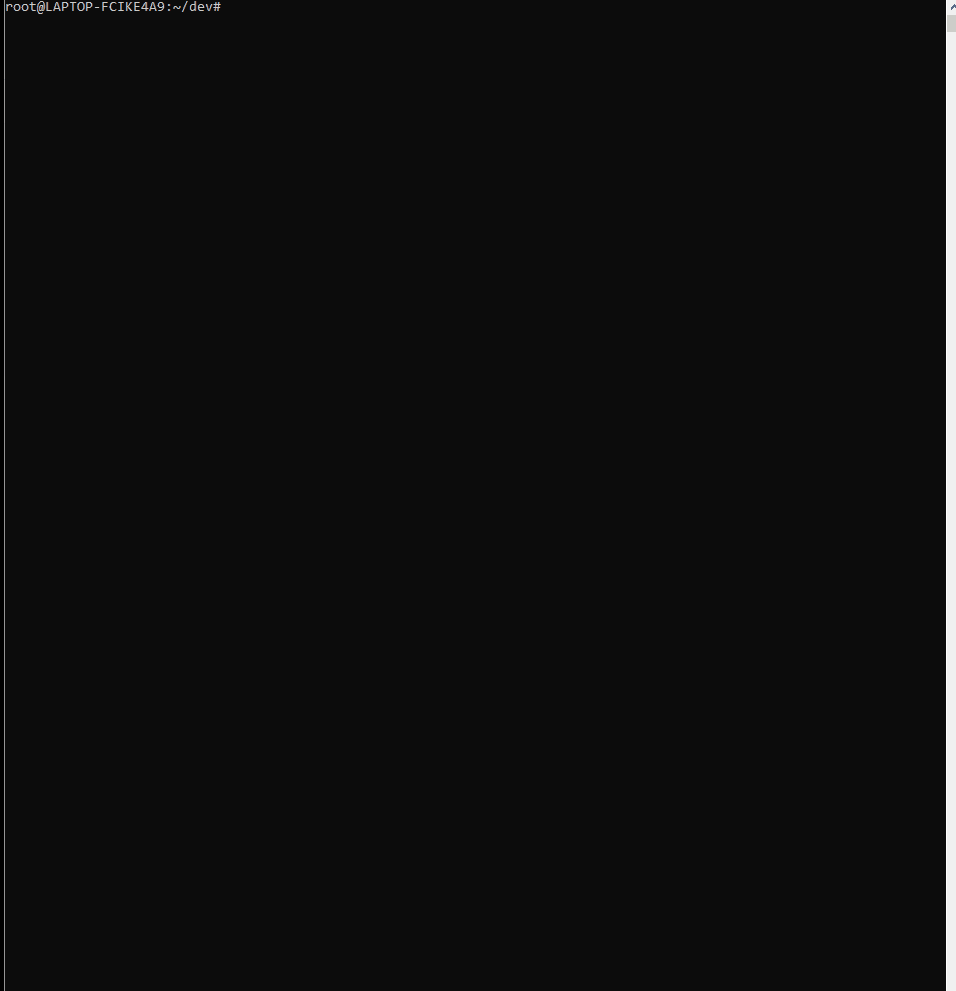

# NodeJS Installation

## Ubuntu
* Execute the commands below
    * `sudo apt-get install nodejs`

## Mac OS
* Execute the command below
    * `brew install node``

## Windows OS
* Open a Powershell as an Administrator.
* Execute the command below
    * `choco install nodejs`

