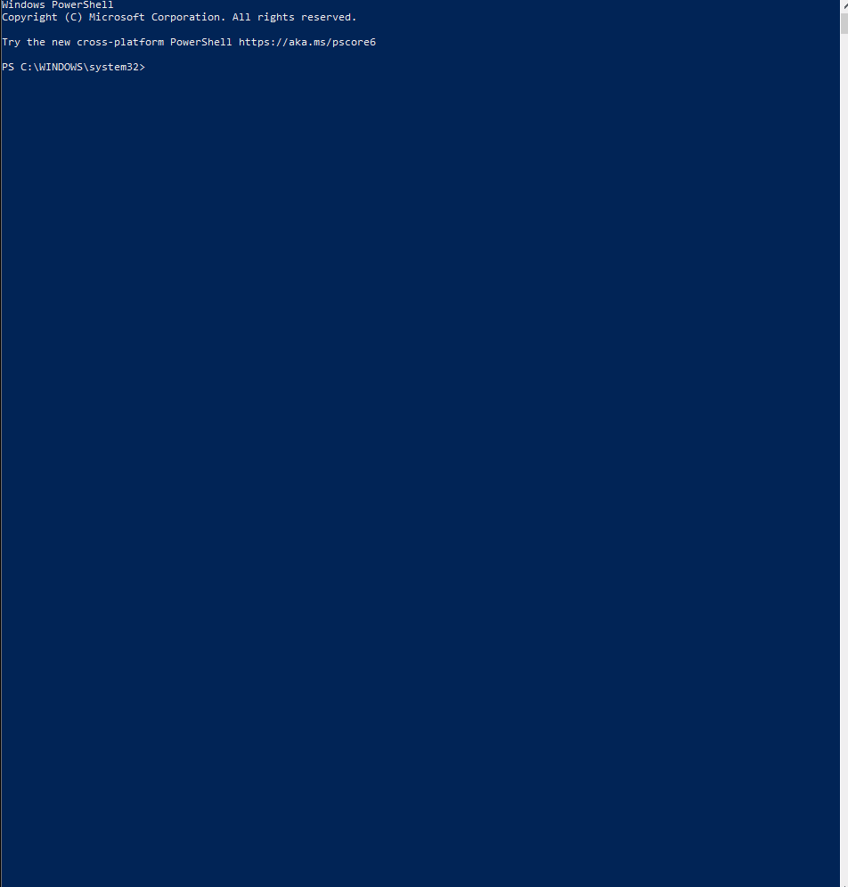
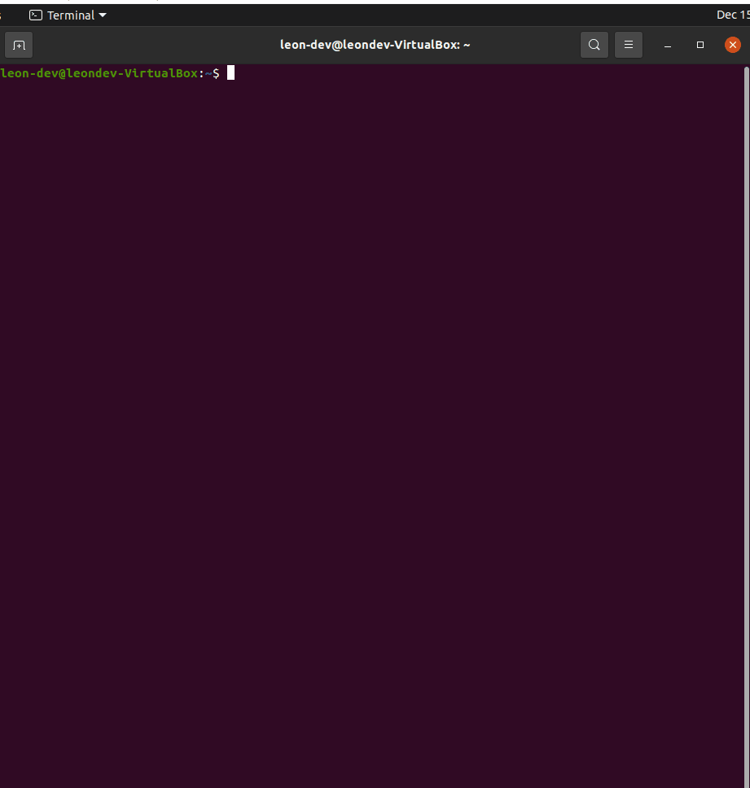

# Yarn Installation


## Windows OS
* Open a Powershell as an Administrator.
* Execute the command below
    * `choco install yarn`

[](./choco-install-yarn.gif)

## Mac OS
* Execute the command below
    * `brew install yarn`


## Ubuntu
* Execute the commands below to install curl
    * `sudo apt-get install curl`

[](./apt-install-curl.gif)

* Execute the commands below to install yarn

```bash
curl -sS https://dl.yarnpkg.com/debian/pubkey.gpg | sudo apt-key add -
echo "deb https://dl.yarnpkg.com/debian/ stable main" | sudo tee /etc/apt/sources.list.d/yarn.list

sudo apt update && sudo apt install yarn
```

[](./apt-install-yarn.gif)