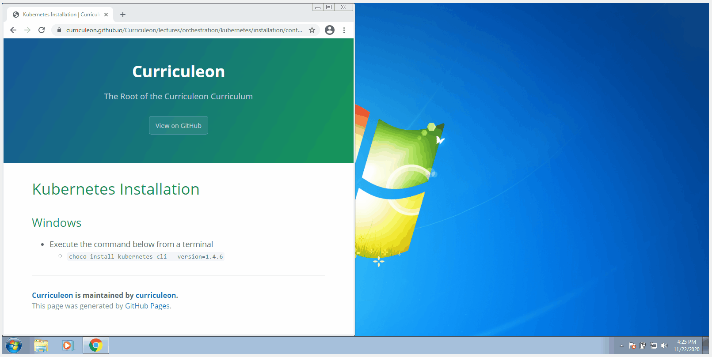

# Kubectl Installation


## Linux OS
* Execute the commands below from a terminal

```bash
sudo apt-get update && sudo apt-get install -y apt-transport-https gnupg2 curl
curl -s https://packages.cloud.google.com/apt/doc/apt-key.gpg | sudo apt-key add -
echo "deb https://apt.kubernetes.io/ kubernetes-xenial main" | sudo tee -a /etc/apt/sources.list.d/kubernetes.list
sudo apt-get update
sudo apt-get install -y kubectl
```

## Mac OS
* Execute the command below from a terminal
    * `brew install kubect`

## Windows
* Execute the command below from a terminal
    * `choco install kubernetes-cli --version=1.4.6`

[](./install-kubernetes.gif)