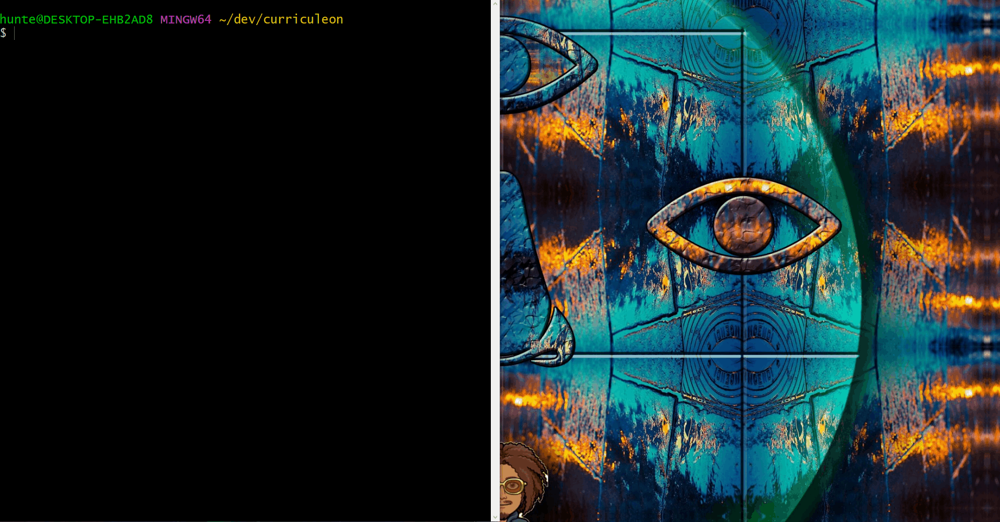

# Minikube Installation

## Install

### Linux OS
* Execute the commands below from a terminal

```bash
sudo apt-get 
```

### Mac OS
* Execute the command below from a terminal
    * `brew install `

### Windows
* Execute the command below from a terminal
    * `choco install minikube`

[](./img/install-minikube.gif)


## Verify Installation


### Start Minikube
* Execute the command below
    * `minikube start --driver=docker`

[](./img/minikube-start.gif)


### Check Minikube Status

* Execute the command below
    * `minikube status`

[](./img/minikube-status.gif)


### Check Kubectl cluster info

* Execute the command below
    * `kubectl cluster-info`

[](./img/kubectl-cluster-info.gif)


### Run Minikube Dashboard
* Execute the command below
    * `minikube dashboard --url`

[](./img/minikube-dashboard.gif)