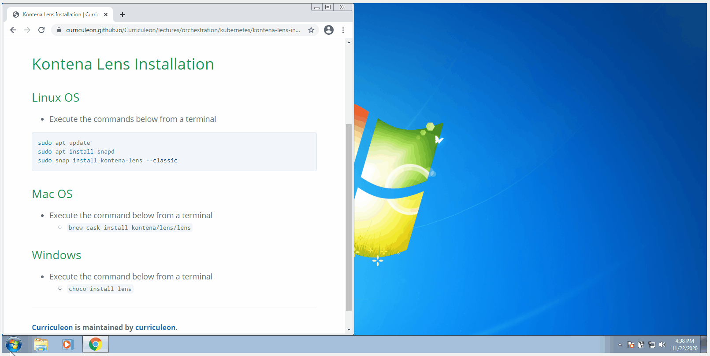

# Kontena Lens Installation


## Linux OS
* Execute the commands below from a terminal

```bash
sudo apt update
sudo apt install snapd
sudo snap install kontena-lens --classic
```


## Mac OS
* Execute the command below from a terminal
    * `brew cask install kontena/lens/lens`

## Windows
* Execute the command below from a terminal
    * `choco install lens`

[](install-lens.gif)