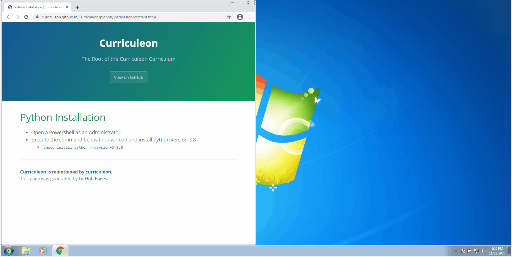

# Python Installation

## Linux OS
* Execute the commands below
    * `sudo apt update`
    * `sudo apt install software-properties-common`
        * gives better control over package manager by enabling PPA (Personal Package Archive) repositories
    * `sudo add-apt-repository ppa:deadsnakes/ppa`
        * a PPA with newer releases than the default Ubuntu repositories
    * `sudo apt update`
    * `sudo apt install python3.8`

## Mac OS
* Execute the command below to download and install [Python](https://www.python.org/downloads/) version 3.8
    * `brew install python`

## Windows OS
* Open a Powershell as an Administrator.
* Execute the command below to download and install [Python](https://www.python.org/downloads/) version 3.8
    * `choco install python --version=3.8.0`

