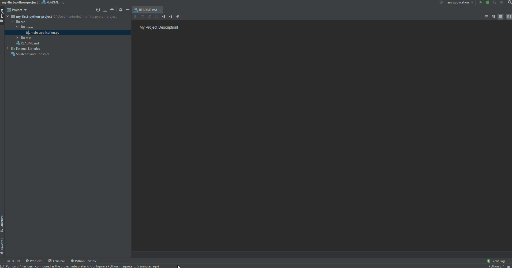
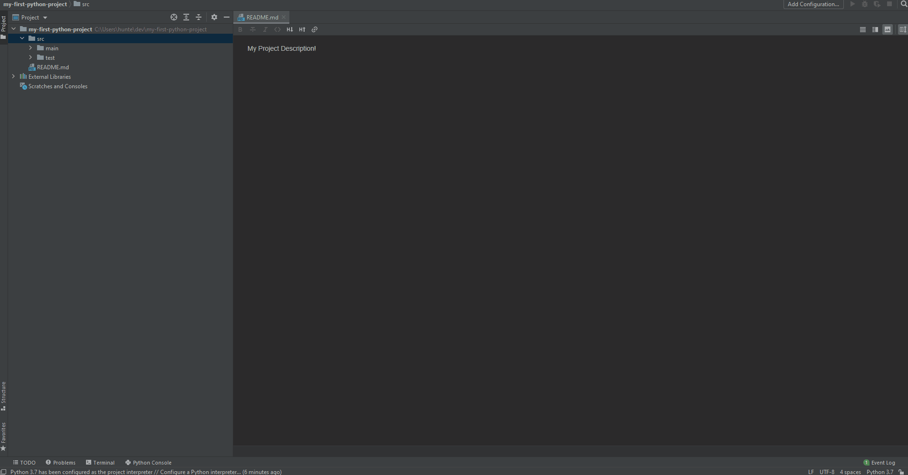
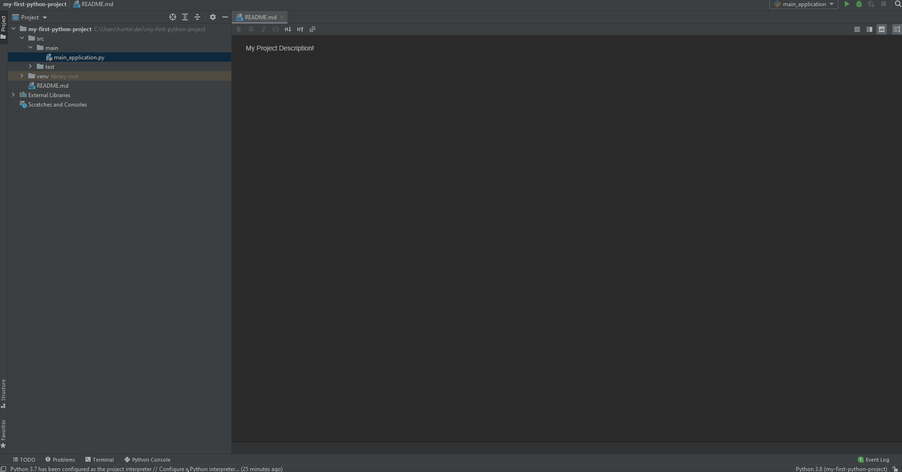
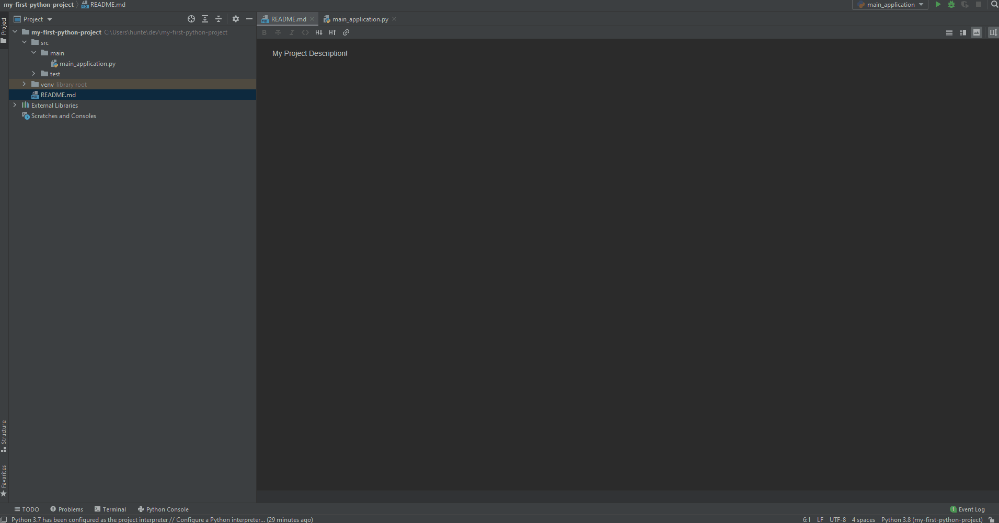

# My First Project

## Overview
1. Prerequisites
2. Create Project From Command Line
3. `Hello World` from PyCharm
4. Getting User Input
5. Tracing Program Execution


### Pre requisites
1. [Install Python](../installation/content.md)
2. [Install PyCharm](../pycharm-installation/content.md)


### Create Project From Command Line

```bat
mkdir my-first-python-project
cd my-first-python-project

mkdir -p src/main/
mkdir -p src/test/

touch src/main/main_application.py
touch src/test/main_application_test.py

echo "My Project Description!" > README.md

start pycharm .
```


[](./create-project.gif)


### Setting Python Interpreter

[](./set-python-interpreter.gif)


### "Hello World" from PyCharm

```python
print("Hello World!")
```

[](./hello-world.gif)


### Reading Input From Console at Runtime

```python
user_input = input("What is your name?")
print("Your name is " + user_input)
```

[](./what-is-your-name.gif)

#### Expanding Expressions

```python
user_input_prompt = "What is your name?"
user_input = input(user_input_prompt)
user_output_prompt_prefix = "Your name is "
user_output_prompt = user_output_prompt_prefix + user_input
print(user_output_prompt)
```

##### Tracing Program Execution

[](./expanding-expressions.gif)


#### Fetching Variable Type

```python
user_input_prompt = "What is your age?"
user_input_as_string = input(user_input_prompt)
user_input_as_string_type = type(user_input)

user_input_as_int = int(user_input_as_string)
user_input_as_int_type = type(user_input_as_int)

print("user_input_as_string: " + user_input_as_string)
print("user_input_as_string_type: " + user_input_as_string_type)
print("user_input_as_int: " + user_input_as_int)
print("user_input_as_int_type: " + user_input_as_int_type)
```

##### Tracing Program Execution