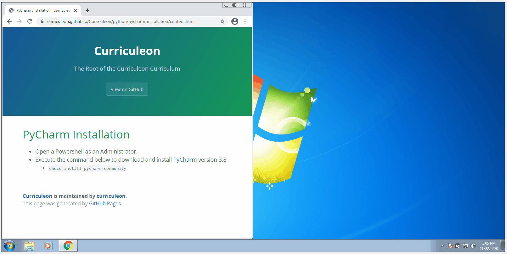

# PyCharm Installation

## Linux OS
* To install all required packages to use Python 3.x with PyCharm, execute the command below
    * `sudo apt install python3-pip python3-distutils`

* To install PyCharm Community version snap package on Ubuntu 16.04 LTS and later, execute the command below
    * `sudo snap install pycharm-community --classic`
    

## Mac OS
* To install PyCharm Community version, execute the command below
    * `brew cask install pycharm-ce`

## Windows OS
* Open a Powershell as an Administrator.
* Execute the command below to download and install [PyCharm](https://www.jetbrains.com/pycharm/download/) version 3.8
    * `choco install pycharm-community`

