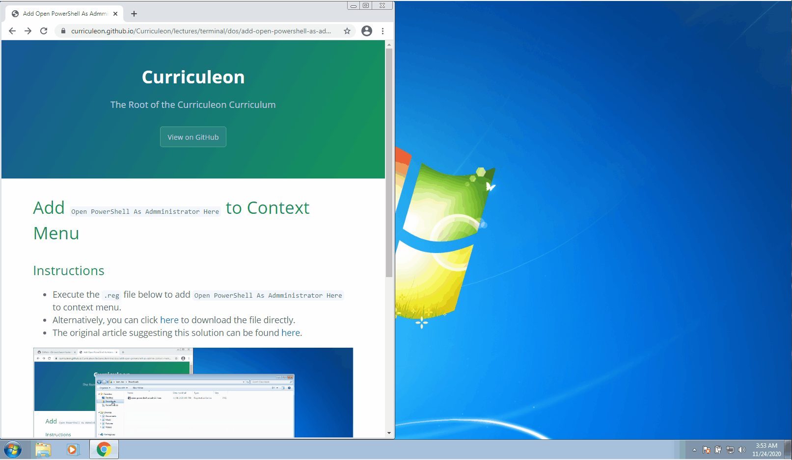

# Add `Open PowerShell As Admministrator Here` to Context Menu

## Instructions
* Execute the `.reg` file below to add `Open PowerShell As Admministrator Here` to context menu.
* Alternatively, you can click [here](./open-powershell-as-admin-here.reg) to download the file directly.
    * Upon downlodaing, `Unblock` the file from the `File Properties` menu.
    * After unblocking the file, open powershell as administrator.
    * From the Admin Powershell terminal, navigate to the directory where the `open-powershell-as-admin-here.ps1` was downloaded.
    * From the parent directory of `open-powershell-as-admin-here.ps1` execute the command below.
        `start ./open-powershell-as-admin-here.ps1`


### Powershell Script

```powershell
Windows Registry Editor Version 5.00

; Created by:Shawn Brink
; Created on: August 13, 2016
; Updated on: April 29, 2020
; Tutorial: https://www.tenforums.com/tutorials/60177-add-open-powershell-window-here-administrator-windows-10-a.html


[HKEY_CLASSES_ROOT\Directory\Background\shell\PowerShellAsAdmin]
@="Open PowerShell window here as administrator"
"Extended"=-
"HasLUAShield"=""
"Icon"="powershell.exe"

[HKEY_CLASSES_ROOT\Directory\Background\shell\PowerShellAsAdmin\command]
@="PowerShell -windowstyle hidden -Command \"Start-Process cmd -ArgumentList '/s,/k,pushd,%V && start PowerShell && exit' -Verb RunAs\""


[HKEY_CLASSES_ROOT\Directory\shell\PowerShellAsAdmin]
@="Open PowerShell window here as administrator"
"Extended"=-
"HasLUAShield"=""
"Icon"="powershell.exe"

[HKEY_CLASSES_ROOT\Directory\shell\PowerShellAsAdmin\command]
@="PowerShell -windowstyle hidden -Command \"Start-Process cmd -ArgumentList '/s,/k,pushd,%V && start PowerShell && exit' -Verb RunAs\""


[HKEY_CLASSES_ROOT\Drive\shell\PowerShellAsAdmin]
@="Open PowerShell window here as administrator"
"Extended"=-
"HasLUAShield"=""
"Icon"="powershell.exe"

[HKEY_CLASSES_ROOT\Drive\shell\PowerShellAsAdmin\command]
@="PowerShell -windowstyle hidden -Command \"Start-Process cmd -ArgumentList '/s,/k,pushd,%V && start PowerShell && exit' -Verb RunAs\""


[HKEY_CLASSES_ROOT\LibraryFolder\Background\shell\PowerShellAsAdmin]
@="Open PowerShell window here as administrator"
"Extended"=-
"HasLUAShield"=""
"Icon"="powershell.exe"

[HKEY_CLASSES_ROOT\LibraryFolder\Background\shell\PowerShellAsAdmin\command]
@="PowerShell -windowstyle hidden -Command \"Start-Process cmd -ArgumentList '/s,/k,pushd,%V && start PowerShell && exit' -Verb RunAs\""


; To allow mapped drives to be available in elevated PowerShell
[HKEY_LOCAL_MACHINE\SOFTWARE\Microsoft\Windows\CurrentVersion\Policies\System]
"EnableLinkedConnections"=dword:00000001
```

* The original article suggesting this solution can be found [here](https://www.tenforums.com/tutorials/60177-add-open-powershell-window-here-administrator-windows-10-a.html).


### Open Windows PowerShell Here as Administrator

[](./open-as-admin-here.gif)


### Remove Context Menu Item

* `placeholder text`

[](./blah.gif)