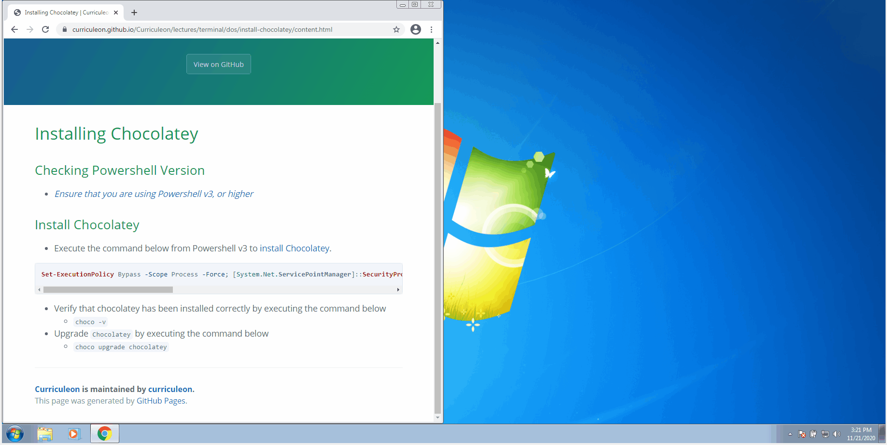

# Installing Chocolatey

<!--
 ## Checking Powershell Version
* [_Ensure that you are using Powershell v3, or higher_](../upgrade-powershell/content.md)
-->

## Video Tutorial
<video width="device-width" height="480" style="border:1px solid green" controls>
  <source type="video/mp4" src="./tutorial.mp4">
</video>

## Install Chocolatey
* Execute the command below from Powershell v3 to install `Chocolatey`.

```powershell
Set-ExecutionPolicy Bypass -Scope Process -Force; [System.Net.ServicePointManager]::SecurityProtocol = [System.Net.ServicePointManager]::SecurityProtocol -bor 3072; iex ((New-Object System.Net.WebClient).DownloadString('https://chocolatey.org/install.ps1'))
```

* If the command above fails, execute the command below from Powershell v3 to [install Chocolatey](https://chocolatey.org/docs/installation).

```powershell
iwr https://chocolatey.org/install.ps1 -UseBasicParsing | iex
```

* Verify that chocolatey has been installed correctly by executing the command below
    * `choco -v`
* Upgrade `Chocolatey` by executing the command below
    * `choco upgrade chocolatey`

[](./install-chocolatey.gif)

### Enable Developer Mode
##### (Optional for Windows 8+ users)
* Execute the command below from Powershell to enable [developer mode](https://docs.microsoft.com/en-us/windows/apps/get-started/enable-your-device-for-development)

```powershell
reg add "HKEY_LOCAL_MACHINE\SOFTWARE\Microsoft\Windows\CurrentVersion\AppModelUnlock" /t REG_DWORD /f /v "AllowDevelopmentWithoutDevLicense" /d "1"
```
