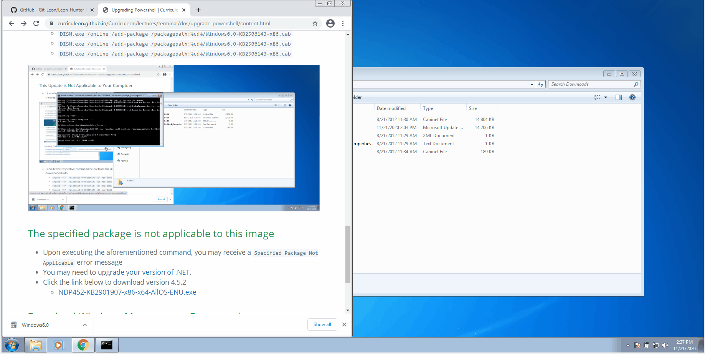
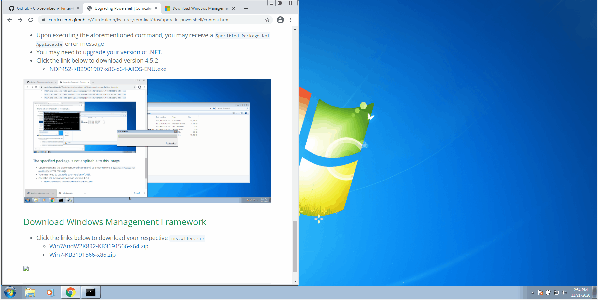
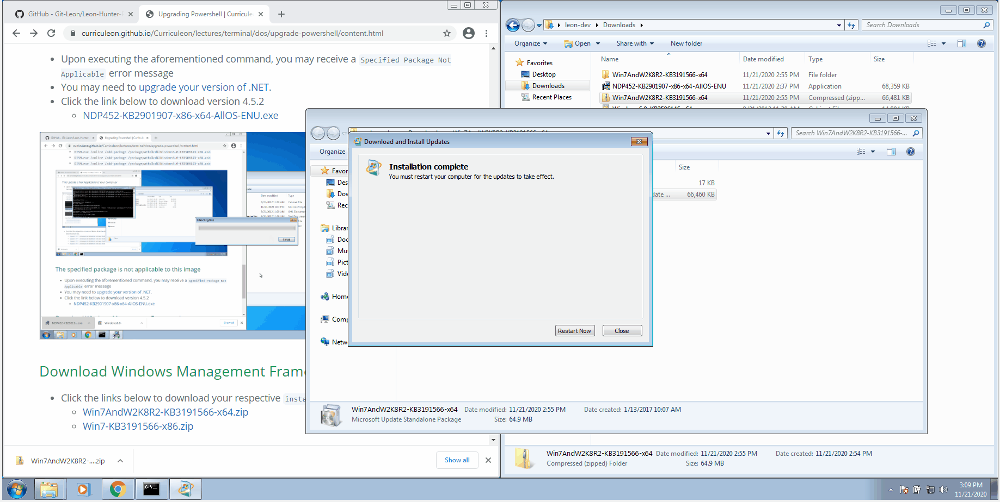

# Upgrading Powershell

<!-- * _Click [here](./full-journey.md) to read about the full journey of disovering this solution._ -->

## Video Tutorial
<video width="device-width" height="480" style="border:1px solid green" controls>
  <source type="video/mp4" src="./tutorial.mp4">
</video>

## Checking Powershell Version
* From the Windows Search bar, find `Powershell`, and ensure you `Open As Administrator`.
* Execute the command below in a Powershell window
    `Get-Host | Select-Object Version`
* In the output, you will see the version of Powershell.    
* Alternatively, execute `$PSVersionTable`
* **If your Powershell version is greater than 4, then none of the following is applicable.**

## Upgrade .NET version
* Click the link below to download version 4.5.2 to upgrade your version of .NET
    * [NDP452-KB2901907-x86-x64-AllOS-ENU.exe](https://download.microsoft.com/download/E/2/1/E21644B5-2DF2-47C2-91BD-63C560427900/NDP452-KB2901907-x86-x64-AllOS-ENU.exe)

## Download Windows Management Framework 
*  Click the links below to download your respective [Windows Management Framework Installer](https://www.microsoft.com/en-us/download/details.aspx?id=54616)
    * [Win7AndW2K8R2-KB3191566-x64.zip](https://download.microsoft.com/download/6/F/5/6F5FF66C-6775-42B0-86C4-47D41F2DA187/Win7AndW2K8R2-KB3191566-x64.zip)
    * [Win7-KB3191566-x86.zip](https://download.microsoft.com/download/6/F/5/6F5FF66C-6775-42B0-86C4-47D41F2DA187/Win7-KB3191566-x86.zip)

## Reboot machine
* Reboot your machine and verify your version of powershell by executing either of the commands below
    * `$PSVersionTable`
    * `Get-Host | Select-Object Version`
    

<!--
https://windowsreport.com/this-update-is-not-applicable-to-your-computer/
https://www.youtube.com/watch?v=8Lrjr5e7R30
-->