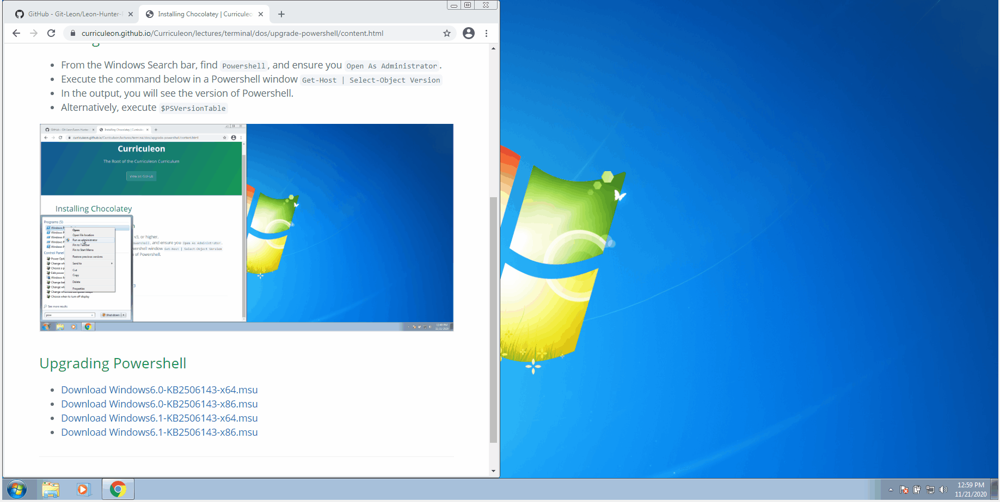
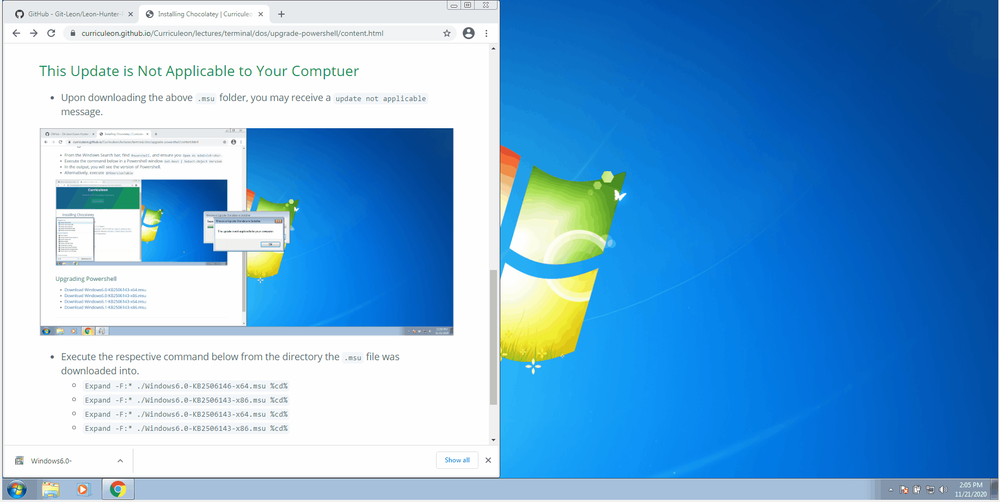
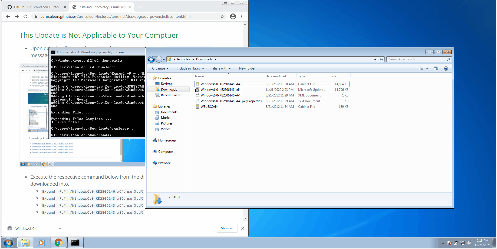

# Upgrading Powershell
* _Ensure that you are using [Powershell v3](https://www.microsoft.com/en-us/download/details.aspx?id=34595), or higher._

## Checking Powershell Version
* From the Windows Search bar, find `Powershell`, and ensure you `Open As Administrator`.
* Execute the command below in a Powershell window
    `Get-Host | Select-Object Version`
* In the output, you will see the version of Powershell.
* Alternatively, execute `$PSVersionTable`

## Upgrading Powershell
* [Download Windows6.0-KB2506143-x64.msu](https://download.microsoft.com/download/E/7/6/E76850B8-DA6E-4FF5-8CCE-A24FC513FD16/Windows6.0-KB2506146-x64.msu)
* [Download Windows6.0-KB2506143-x86.msu](https://download.microsoft.com/download/E/7/6/E76850B8-DA6E-4FF5-8CCE-A24FC513FD16/Windows6.0-KB2506146-x86.msu)
* [Download Windows6.1-KB2506143-x64.msu](https://download.microsoft.com/download/E/7/6/E76850B8-DA6E-4FF5-8CCE-A24FC513FD16/Windows6.1-KB2506143-x64.msu)
* [Download Windows6.1-KB2506143-x86.msu](https://download.microsoft.com/download/E/7/6/E76850B8-DA6E-4FF5-8CCE-A24FC513FD16/Windows6.1-KB2506143-x86.msu)

## This Update is Not Applicable to Your Comptuer
* Upon downloading the above `.msu` folder, you may receive a `update not applicable` message.

* Execute the respective command below from the directory the `.msu` file was downloaded into.
    * `Expand -F:* ./Windows6.0-KB2506146-x64.msu %cd%`
    * `Expand -F:* ./Windows6.0-KB2506143-x86.msu %cd%` 
    * `Expand -F:* ./Windows6.0-KB2506143-x64.msu %cd%`
    * `Expand -F:* ./Windows6.0-KB2506143-x86.msu %cd%`

* Execute the respective command below from the directory the `.cab` file was expanded into.
    * `DISM.exe /online /add-package /packagepath:%cd%/Windows6.0-KB2506146-x64.cab`
    * `DISM.exe /online /add-package /packagepath:%cd%/Windows6.0-KB2506143-x86.cab`
    * `DISM.exe /online /add-package /packagepath:%cd%/Windows6.0-KB2506143-x64.cab`
    * `DISM.exe /online /add-package /packagepath:%cd%/Windows6.0-KB2506143-x86.cab`

## The specified package is not applicable to this image

* Upon executing the aforementioned command, you may receive a `Specified Package Not Applicable` error message
* You may need to [upgrade your version of .NET](https://dotnet.microsoft.com/download/dotnet-framework).
* Click the link below to download version 4.5.2
    * [NDP452-KB2901907-x86-x64-AllOS-ENU.exe](https://download.microsoft.com/download/E/2/1/E21644B5-2DF2-47C2-91BD-63C560427900/NDP452-KB2901907-x86-x64-AllOS-ENU.exe)

## Download Windows Management Framework 
*  Click the links below to download your respective [Windows Management Framework Installer](https://www.microsoft.com/en-us/download/details.aspx?id=54616)
    * [Win7AndW2K8R2-KB3191566-x64.zip](https://download.microsoft.com/download/6/F/5/6F5FF66C-6775-42B0-86C4-47D41F2DA187/Win7AndW2K8R2-KB3191566-x64.zip)
    * [Win7-KB3191566-x86.zip](https://download.microsoft.com/download/6/F/5/6F5FF66C-6775-42B0-86C4-47D41F2DA187/Win7-KB3191566-x86.zip)

## Reboot machine
* Reboot your machine and verify your version of powershell by executing either of the commands below
    * `$PSVersionTable`
    * `Get-Host | Select-Object Version`
    

<!--
https://windowsreport.com/this-update-is-not-applicable-to-your-computer/
https://www.youtube.com/watch?v=8Lrjr5e7R30
-->