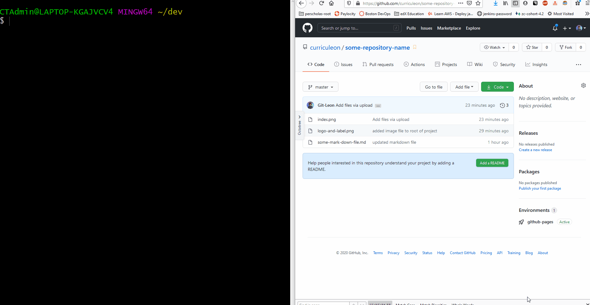

# Github Pages

### Video Tutorial
* Click here to view the [video tutorials](./content.md) on how to complete this task.
* Below there are two different approaches for how to deploy a github page

### Preparing Files for Github Pages
* Ensure that the names of the files in the repository make sense.
* Be sure to include a file named `index.md` at the root directory of the repository
* Github Pages will
  1. seek a file named `index.md` at the root directory of this repository
  2. _transpile_ the `index.md` to `.html` code
  3. _deploy_ the transpiled code to Github Pages Environment
  4. _host_ the code as a webpage

### Deploying to Github Pages
* Navigate to the `Settings` tab at the top of this repository's Github interface.
* Select `master` as the _source_ for your Github Pages.
  * This will generate a URL that allows you to visit the deployment artifact (a webpage)
* Find the newly generated URL.
* Paste the newly generated URL in the `Website` field of this repository
* Click the newly added `Website` field of this repository to view the deployment artifact.
  * _The website may take up to 10 minutes to become accessible._
* The site should become accessible at a URL with the pattern below
  * https://MY_USERNAME.github.io/MY_REPOSITORY_NAME/

### Applying a Jekyl Theme to Github Pages
* From the _root directory of the project_, execute the commands below to add a theme.
* Execute the command below to create a new file named `_config.yml` with the contents of `theme: jekyll-theme-modernist`
  * `echo theme: jekyll-theme-modernist > _config.yml`
* Execute the command below to `add` the new changes to be ready for `commit`ing
  * `git add .`
* Execute the command below to `commit` the newly added changes to be ready for `push`ing
  * `git commit -m "I added a config with a theme"`
* Execute the command below to `push` the newly `commit`ed changes to your github repository.
  * `git push`
* The changes to the site should become observable at a URL with the pattern below
  * https://MY_USERNAME.github.io/MY_REPOSITORY_NAME/