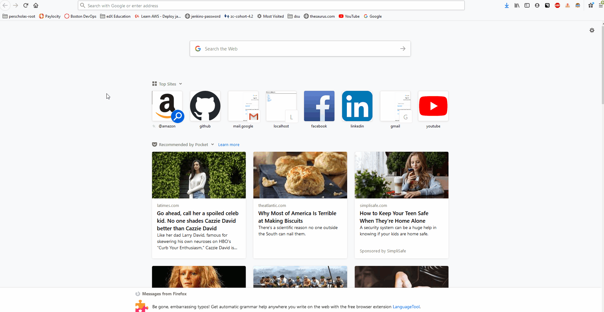
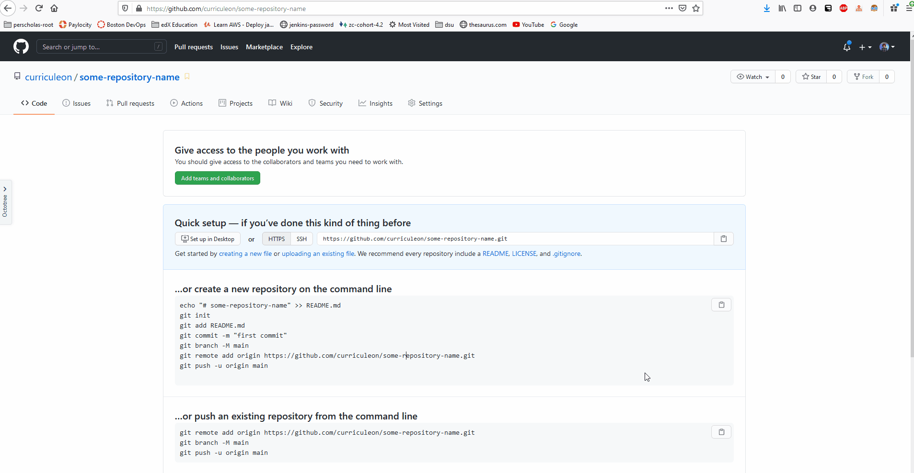
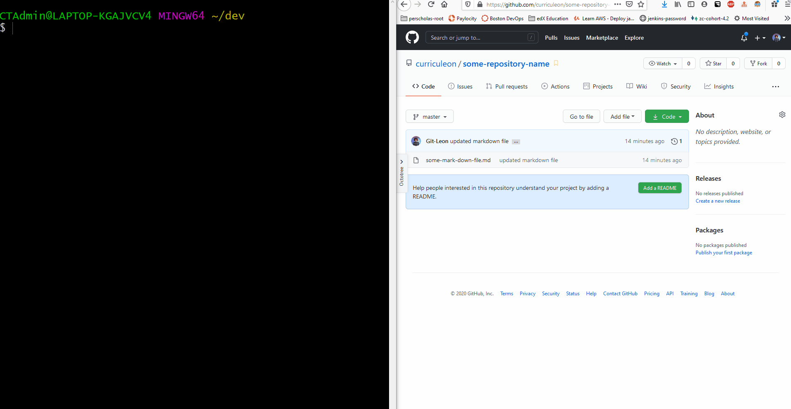
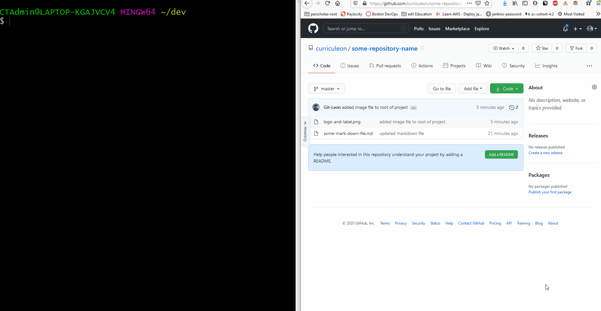

# Creating a Repository

<video width="device-width" height="480" style="border:1px solid green" controls>
  <source type="video/mp4" src="./instructor-first-repository.mp4">
</video>


### Generating a Token
* **Watch this video if your `commit` or `push` failed!**

<video width="device-width" height="480" style="border:1px solid green" controls>
  <source type="video/mp4" src="./generating-auth-token.mp4">
</video>

#### Generating an ssh Key
* Execute [the commands below](./generate-ssh-for-git.sh) if the command above failed **AND you're prompted for a fingerprint**!


```bash
#!/bin/bash

# replace $1 with your github username
username=$1

# replace $2 with your github email
email=$2

# reset git config
git config --system --unset credential.helper

# set git config 
git config --global user.name $username
git config --global user.email $email

# generate ssh-key used for authentication
ssh-keygen -t rsa -m PEM -C $email

# copy ssh-key to clipboard
clip < ~/.ssh/ida_rsa.pub
pcbopy < ~/.ssh/ida_rsa.pub


echo navigate to https://github.com/settings/keys and paste the contents of your clipboard
```


### Create a Remote Repository
1. Navigate to `github.com/new`
2. click "new" button at the top right of browser

[](./git.create-remote-repo.gif)


### Creating a Local Repository and Pushing to Remote Repository
1. Navigate to the root folder of the project you would like to become a repository.
2. `git init`
	* this generates a `.git` folder in this directory.
	* the `.git` tells this directory that it is a git-repository, enabling subsequent `git` commands in this directory.
3. `git add .`
	* adds all _changes_ in this directory to the repository
	* _this modifies the contents of the aforementioned `.git` folder_
4. `git commit -m 'my update message'`
	* commits these changes to be pushed onto the web
	* _this modifies the contents of the aforementioned `.git` folder_
5. `git push -u origin master`
	* _pushes_ the committed changes onto the web, making them accessible through the web.
	* _the local `.git` is compared to the remote `.git`, and respective changes are written as a new commit_

  [](./git.push-local-changes.gif)


### Cloning a Preexisting Project
* From a browser, navigate to the URL of the GitHub repository you would like to clone.
* Copy the URL of the repository your clipoboard.
* From a terminal, do the following:
   * Create a `dev` directory in your home directory.
      * `mkdir ~/dev`
   * Change directories to `~/dev`
      * `cd ~/dev`
   * Clone project into `~/dev` directory and _alias_ project directory as `my-project`
      * `git clone {repository_url} my-project`


### Adding Changes to Preexisting Git Repository
1. navigate to the root directory of the project on your local machine
2. add changes
	* `git add .`
3. commit change
	* `git commit -m 'update message'`
4. push changes to web
	* `git push -u origin master`
5. Refresh the webpage to ensure your changes are visible.

[](./git.push-to-preexisting-repo.gif)


### Pulling Changes from Remote Repository to Local Repository
* If there are changes on your remote repository that are not on your local repository, you can execute the command below to fetch the changes.
  * `git pull origin master`

[](./git.pulling-changes.gif)