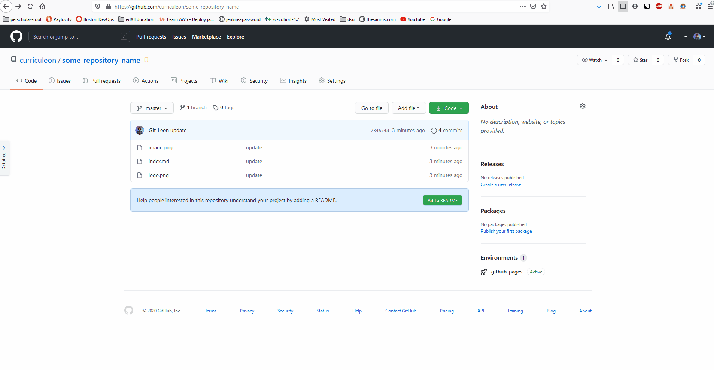
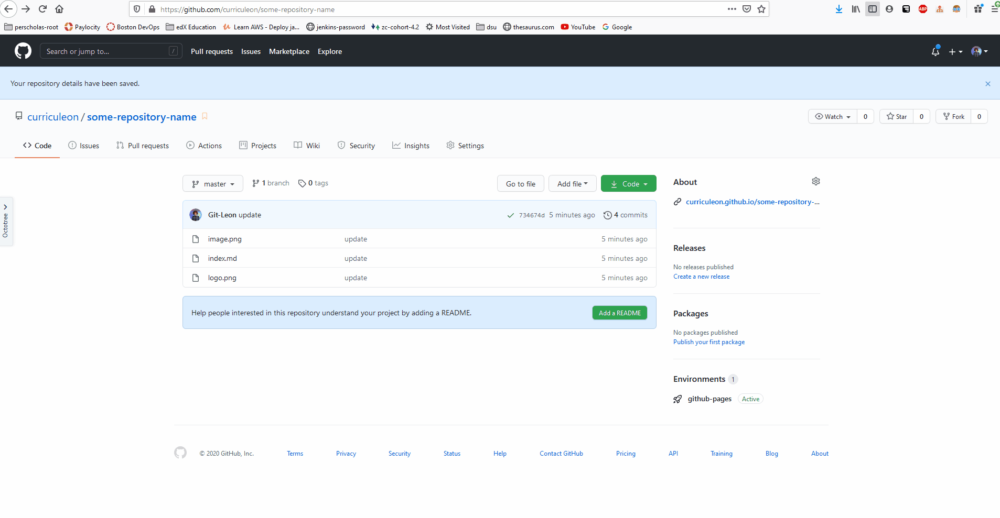

# Github Pages

### Creating Gitlab Page Project
* Navigate to [`https://gitlab.com/pages`](https://gitlab.com/pages) to select a new page-template

### Preparing Files for Gitlab Pages
* Ensure that the names of the files in the repository make sense.
* Be sure to include a file named `index.md` at the root directory of the repository
* Gitlab Pages will leverage Jekyll to
  1. seek a file named `index.md` at the root directory of this repository
  2. _transpile_ the `index.md` to `.html` code
  3. _deploy_ the transpiled code to Github Pages Environment
  4. _host_ the code as a webpage

### Deploying to Github Pages
* Navigate to the `Settings` tab at the top of this repository's Github interface.
* Select `master` as the _source_ for your Github Pages.
  * This will generate a URL that allows you to visit the deployment artifact (a webpage)
* Find the newly generated URL.
* Paste the newly generated URL in the `Website` field of this repository
* Click the newly added `Website` field of this repository to view the deployment artifact.
  * The website may take up to 10 minutes to become accessible.

### Applying a Jekyl Theme to Github Pages
* Navigate to the `Settings` tab at the top of this repository's Github interface
* Select `theme` from the Github Pages section to navigate to the theme-selection dashboard
* From the theme-selection dashboard, select a theme you like.
* After applying the theme, revisit the `Website` field of this repository to verify the changes have taken place

