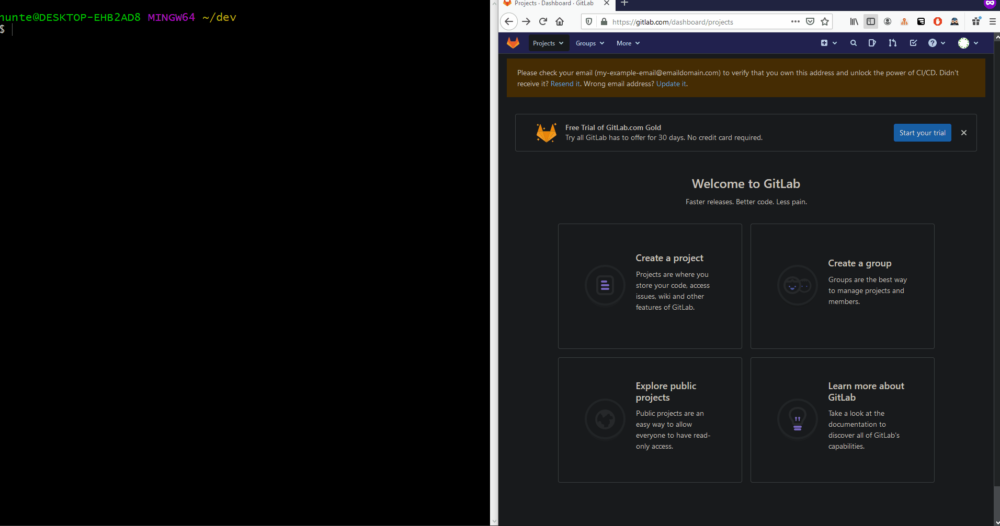

# Creating a Repository

### Create a Remote Repository
1. Navigate to `https://gitlab.com/projects/new`
2. click `Create Blank Project` button

### Creating a Local Repository and Pushing to Remote Repository
1. Navigate to the root folder of the project you would like to become a repository.
2. `git init`
	* this generates a `.git` folder in this directory.
	* the `.git` tells this directory that it is a git-repository, enabling subsequent `git` commands in this directory.
3. `git add .`
	* adds all _changes_ in this directory to the repository
	* _this modifies the contents of the aforementioned `.git` folder_
4. `git commit -m 'my update message'`
	* commits these changes to be pushed onto the web
	* _this modifies the contents of the aforementioned `.git` folder_
5. `git push -u origin master`
	* _pushes_ the committed changes onto the web, making them accessible through the web.
	* _the local `.git` is compared to the remote `.git`, and respective changes are written as a new commit_

### Cloning a Preexisting Project
* From a browser, navigate to the URL of the GitHub repository you would like to clone.
* Copy the URL of the repository your clipoboard.
* From a terminal, do the following:
   * Create a `dev` directory in your home directory.
      * `mkdir ~/dev`
   * Change directories to `~/dev`
      * `cd ~/dev`
   * Clone project into `~/dev` directory and _alias_ project directory as `my-project`
      * `git clone {repository_url} my-project`

### Adding Changes to Preexisting Git Repository
1. navigate to the root directory of the project on your local machine
2. add changes
	* `git add .`
3. commit change
	* `git commit -m 'update message'`
4. push changes to web
	* `git push -u origin master`
5. Refresh the webpage to ensure your changes are visible.

### Pulling Changes from Remote Repository to Local Repository
* If there are changes on your remote repository that are not on your local repository, you can execute the command below to fetch the changes.
  * `git pull origin master`
