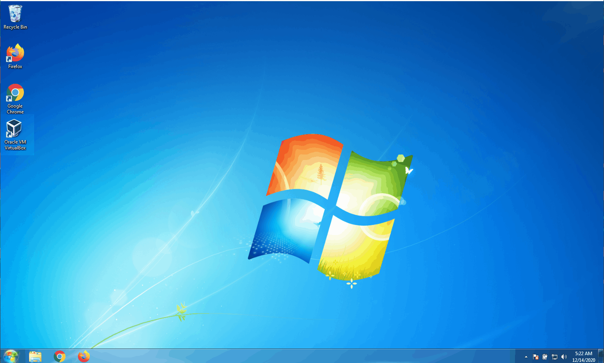

# Virtual Box Basics
* Execute the command below to enable virtualization of a virtual machine
    * `VBoxManage modifyvm my-vm-name --mouse ps2`

* Execute the command below [from the user manual](http://virtualbox.org/manual/ch09.html#mouse-capture) if the command above fails.
    * `VBoxManage setextradata "VM name" GUI/MouseCapturePolicy Disabled`