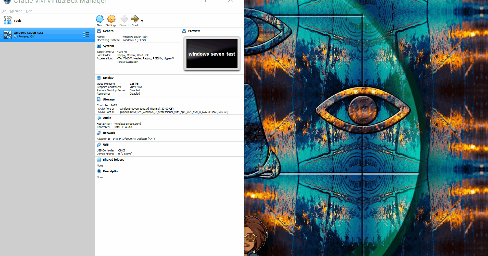
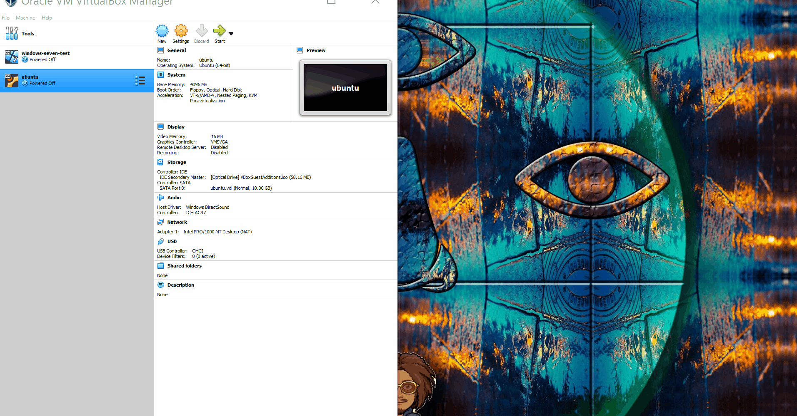
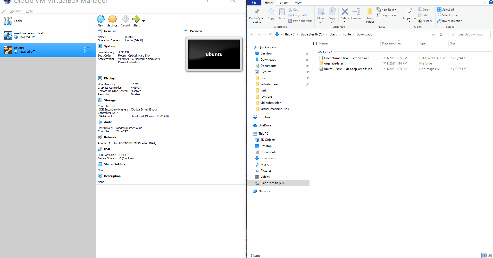
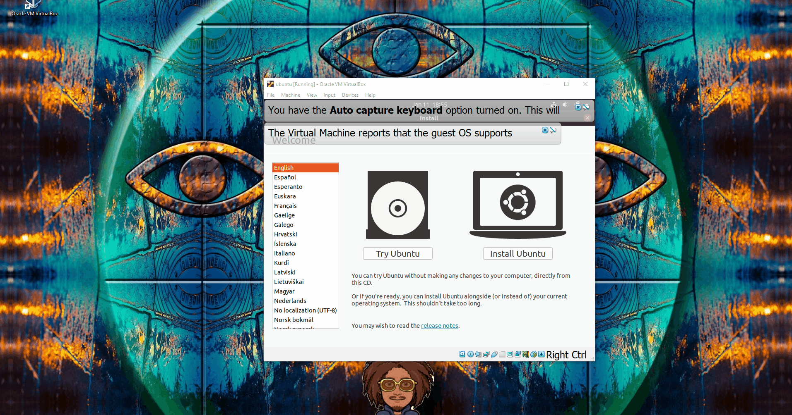
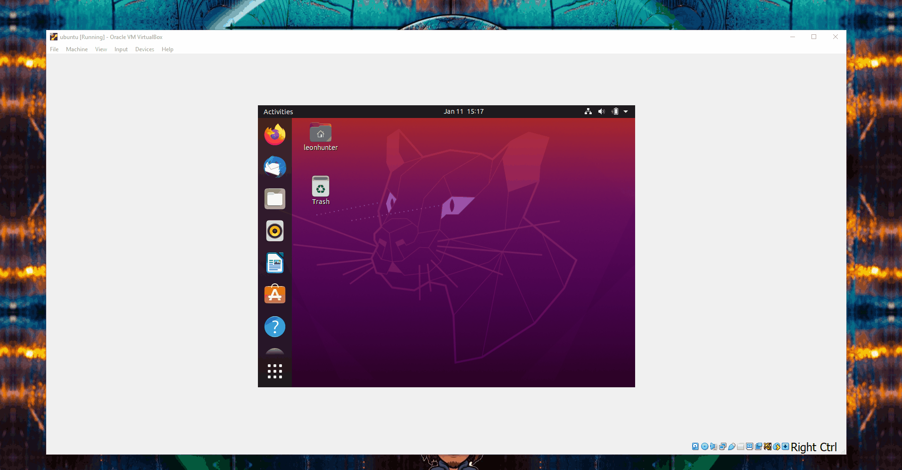
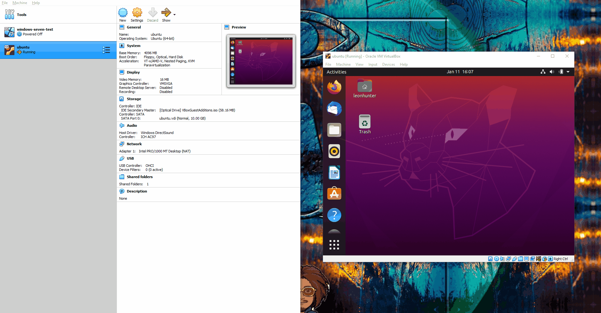
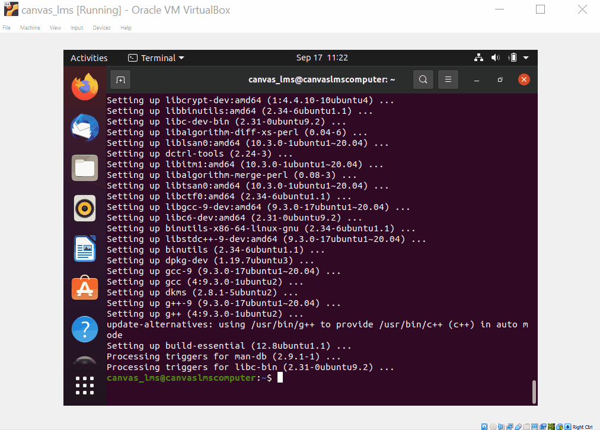
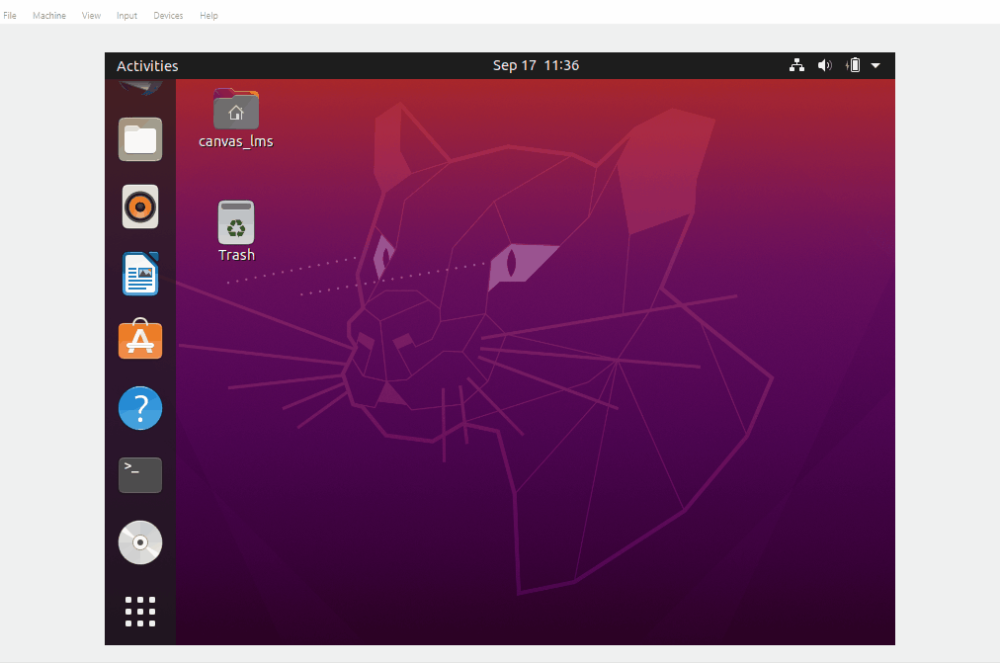
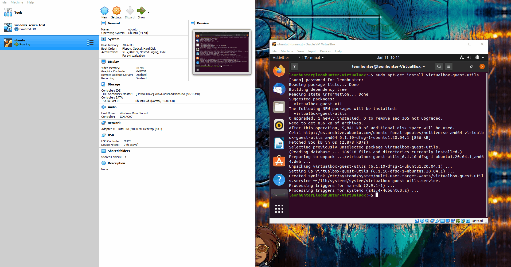

# Virtual Box Ubuntu Installation

## Overview
1. Prerequisites
2. Download Ubuntu
3. Install Ubuntu Iso
4. Install Ubuntu OS
5. Install Guest Additions

### Prerequisites
* [Install Virtualbox](../installation/index.md)

### Download Ubuntu
* Navigate to the link below to download an Ubuntu disk image.
    * [`https://ubuntu.com/download/desktop`](https://ubuntu.com/download/desktop)

### Create Ubuntu Virtual Disk Image
* From Virtualbox
    * Select `New`
    * Enter name of Virtual Machine
    * Enter amount of RAM to allocate to Virtual Machine
    * Enter amount of storage to allocate to Virtual Machine

### Enable Bidirectional Clipboard
* Select `Settings > General > Advanced`.
    * Ensure `Shared Clipboard` is enabled
    * Ensure `Drag'N'Drop` is enabled

### Install Ubuntu ISO
* From Virtualbox, launch the newly created `Ubuntu` virtual machine.
* Upon being prompted, navigate to the newly downloaded `Ubuntu` disk image.

### Install Ubuntu OS
* Launch the `Ubuntu` virtual machine

### Install Prerequisite Packages
* Execute the command below from a terminal to install prerequisite packages.
    * `sudo apt install linux-headers-$(uname -r) build-essential dkms`

### Install Guest Additions
* Execute the command below from a terminal to install virtualbox guest additions.
    * `sudo apt-get -y install virtualbox-guest-utils`

### Insert Guest Additions CD
* Insert guest additions CD and follow prompts

### Restart the machine
* Execute the command below from a terminal to restart the virtual machine.
    * `sudo shutdown -r now`

### Verify Guest Addition installation
* Resize the window to ensure that the guest operating system is resized respectively.

