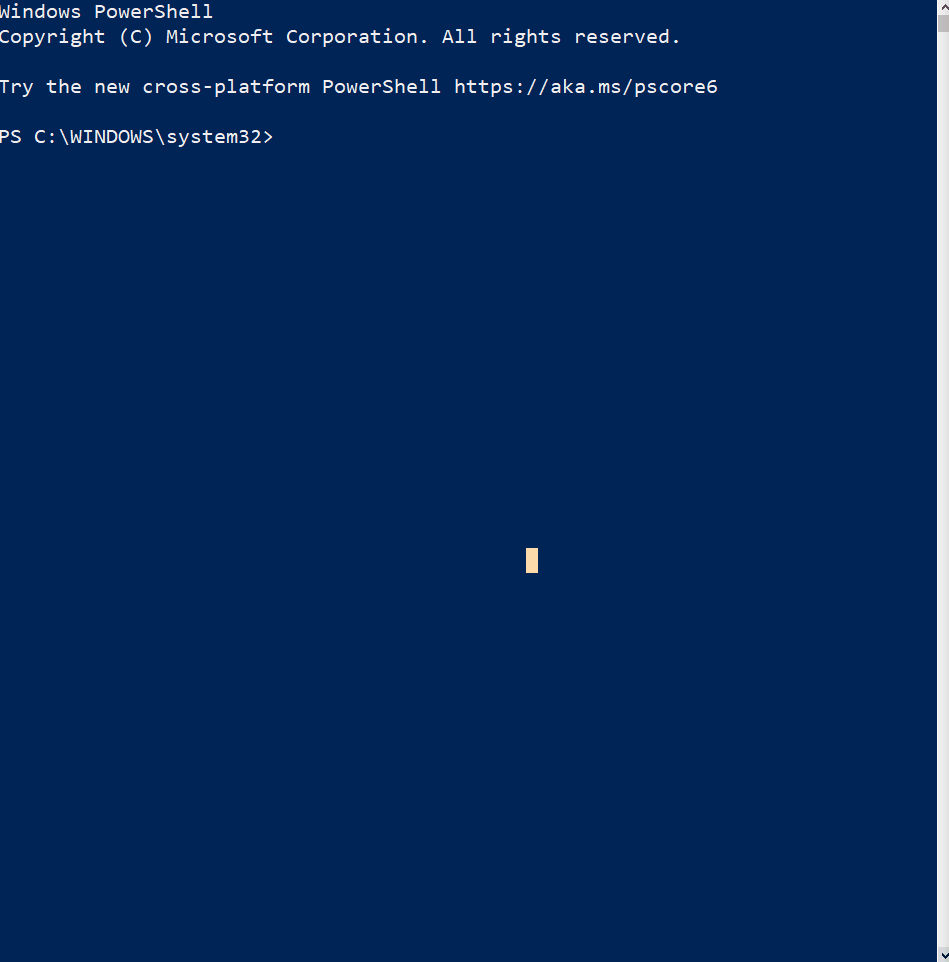

# VMWare Workstation Player

## Overview
1. Prerequisites
2. Installation

### Prerequisites
* Chocolatey

### Installation
* Execute the command below from an elevated Powershell terminal to install VMWare Workstation player
    * `choco install vmware-workstation-player`

